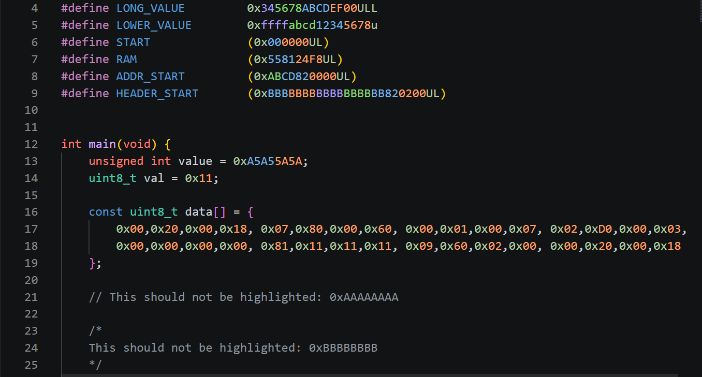

# HEX Nibble Highlighter

### Highlights C/C++ hexadecimal integer literals in 4-digit groups (per byte)

## Features
- Supports C and C++ files
- Highlights hexadecimal literals after `0x` or `0X`
- Groups digits from the right side
- Skips hexadecimal values inside line comments and block comments
- Uses darker colors on light themes
- Uses editor decorations only
- Does not modify source files

## Notes
This extension only changes the visual rendering in the editor. It does not change the actual file content.

**Enjoy!**
